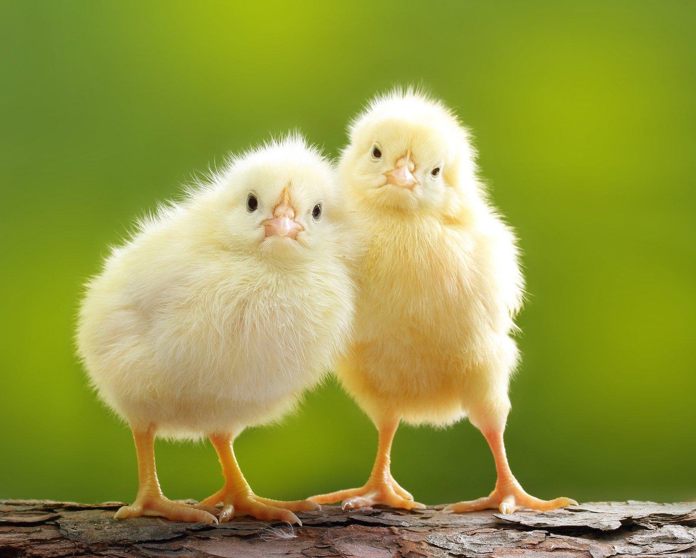

# Немного о себе #

## Привет! ##

_Я начинающий программист_

Сегодня хочу рассказать о том как _сохранять_ **мотивацию** и _увеличить_ **время** в сутках.

Во всех начинаниях самое главное:

1. Желание
2. Юмор 
3. Конечная цель
   

Когда есть все три составляющих то найдется время поработать еще и ночью!

_Ну а если говорить по честному, нужно **наслаждаться жизнью**!_

**С любовью Цип**

